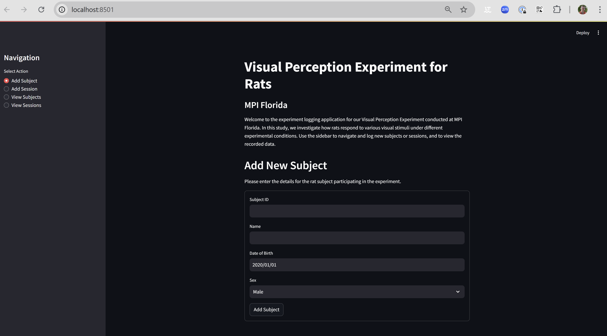
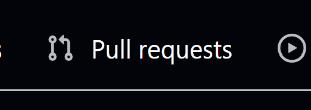

# Day1-Experiment Database
An exercise in adding Dependency-Documented Reproducibility in a Streamlit App

This contains a web server that launches an interface for logging subjects and sessions in a hypothetical experiment.




## Setup

(Instructions Here)

## Running the App

Run the app directly with a 

```bash
streamlit run experiment_db.py
```

## Exercise


### Step 1: Fork this Project to Get your Own Copy

In GitHub, click the "Fork" Button in the upper-right corner of the GitHub Window:


### Step 2: Clone Your Fork Into a VSCode Project


| Command | Description |
| :-- | :-- |
| `git clone <url> experiment_db` | Clone the project into a folder called "experiment_db" |
| `cd experiment_db` | Change the working directory to the experiment_db folder. |
| `code .` | Launch VSCode in the Current Folder |


### Step 3: Get the Application to Run

Choose a Package Manager: Either [Conda](https://docs.conda.io/projects/conda/en/stable/user-guide/index.html) or [Pixi](https://pixi.sh/latest/).


If Using Conda:

| Command | Description |
| :-- | :-- |
| `conda create -p ./venv` | Setup Environment |
| `conda activate ./venv` | Activate Environment |
|  `conda install python=3.12` | Install Conda Dep |
| `pip install numpy` | Install Python Dep with Pip (note: Python must be installed first) |

If Using Pixi:

| Command | Description |
| :-- | :-- |
| `pixi init` | Setup Environment |
| `pixi shell` | Activate Environment |
|  `pixi add python=3.12` | Install Conda Dep |
| `pixi add --pypi numpy` | Install Python Dep with Pip (note: Python must be installed first) |


### Step 4: Add the needed dependencies to a file in the root directory of this project

If using Conda:

| Command | Description |
| :-- | :-- |
| `conda env export -f environment.yaml` | Make environment file |

If using Pixi, the `pixi.toml` should already be made--nothing to do!


### Step 5: Check that your dependency file is working, by deleting the environment and starting again.

If using Conda:

| Command  | Description |
| :-- | :-- |
| `conda env remove -p ./venv` | Delete the environment. |
| `conda env create -p ./venv -f environment.yaml` | Create a new environment from the environment.yaml file. |

If using Pixi:

| Command | Description |
| :-- | :-- |
| `rmdir ./venv` | Delete the environment directory (doens't use Pixi, just deletes the folder) |
| `pixi install` | Create a new environment from the `pixi.toml` file. |

### Step 6: Commit the dependencies to the git repo

If using Git for the first time, you'll need to add your name and email first for signing your commits:

| Command | Description |
| :-- | :-- |
|`git config --global user.name "My Name"` | Add your name to commits.  Usually this is your real name, not a GitHub username, but it doesn't matter what you use. |
| `git config --global user.email "myemail@email.com"` | Add your email to commits. Note: doesn't have to be the same email you used with GitHub, but it is helpful if it is a real email address (because it helps your portfolio throuhg GitHub)|


Only add the `environment.yaml` or `pixi.toml` file, not any of the files in the `venv/` folder.  

| Command | Description |
| :-- | :-- |
| `git status` | See what Git is noticing as changes. |
| `git add myfile` | Start tracking "myfile" |
| `git commit -am "message"` | Commit all changes to the tracked files with the note "message" |
| `git log` | See what the recent commits were. May need to press the `q` key to exit the log.  |

### Step 7: Document the Installation in the Readme

Write the required steps for installing the dependencies for this code in the "Setup" section of this Readme file, then commit the updated Readme file.


### Step 8: Push the latest commits to your GitHub Fork

| Command | Description  |
| :-- | :-- |
| `git remote -v` | See the name and urls of all remote repositories |
| `git remote add <name> <url>` | Add a new git remote, if needed.  Name can be anything, URL should be a github repo. |
| `git remote remove <name>` | Remove a git remote, if needed. |
| `git branch` | See the names or all branches.  The one with a star next to it is the active branch. |
| `git push origin main` | Push the branch called "main" to the remote called "origin" |


### Step 9: On the GitHub website Make a Pull Request to the main repository, requesting that your changes be added!

1. Click on the Pull Request Tab:



2. Click New Pull Request:


3. Fill out the form and send the request!


### Done!

Now a more-reproducible application has been made, and contributed to the original author--a collaboration on open-source software!

## Contributors
- wenhua sun 25.02.25

- installing the dependencies
1. clone the repository in local working directory
git clone https://github.com/wenhuasun/Day1-ExperimentDB.git experiment.db
cd experiment_db
open VScode to open this folder
2. create environment
conda create -p ./venv 
conda activate ./venv
conda install python=3.10 ## if install python 3.10 to align with streamlit as 3.12 not working with streamlit
3. install required independencies
conda env export -f environment.yaml
4. check dependency file is working
conda env remove -p ./venv
conda env create -p ./venv -f environment.yaml
5. commit dependency
git config --global user.name "wenhuasun"  ##first time need to do
git config --global user.email "WenhuaSun_@hotmail.com"  ##first time need to do
git status ## see git noticing changes
git add environment.yaml
git commit -am "message" ## commit all changes can message change into other words
git log ## see recent commits
